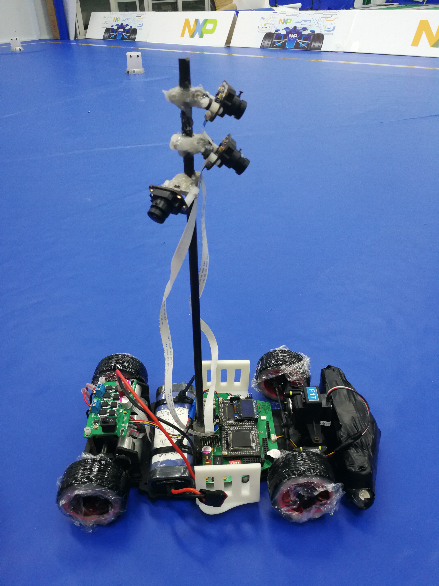

# SmartCar_K60DN512

## Introduction

This project was for the 13th [NXP Cap National University Students Intelligent Car Race](https://smartcar.cdstm.cn/index). Our team, on behalf of Chongqing University, won the First Prize in the Signal-Targeted group. I was responsible for algorithm design and coding, with my two teammates doing mechanical part and circuit boards respectively.

## Details

I named our car for the final national-wide contest MarkFour and it consists of the following: 

- **Three cameras**: Main camera for locating signal. Obstacle-avoiding camera for detecting obstacle. Side-view camera for finding signals that are of the vision of the main camera.
- **Two motors and their driver board**: Providing traction and braking power.
- **Two photoelectric encoders**: Measuring the speed of two rare wheels.
- **Servo motor**: Controling the angle for front wheels.
- **Two NXP Kinetis K60 MCUs**: Analysing singals from cameras and encoders. Making decisions and controlling motors.
- **Motherboard**: Connecting and providing support for electric components.
- **Buttons/LED Screen/Bluetooth**: Enabling operators to change parameters and the car to sending back data in real time.
- **Battery**: Connected to motor driver board and mother board.

The project is writen in C and built with IAR. Codes in folder **20180818MarkFourSlave** and **20180818MarkFourMaster** are the final version, one for each MCU.

## Performance
The following video clip shows MarkFour's performance. The positions for signal lights on the ground are randomly chosen. The car needs to locate where the new signal is and run to it as fast as possible, avoidng potential collisions with objects. The following process took MarkFour 11.9s.

